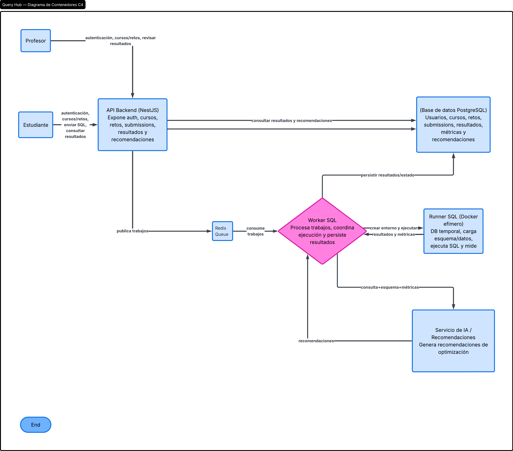
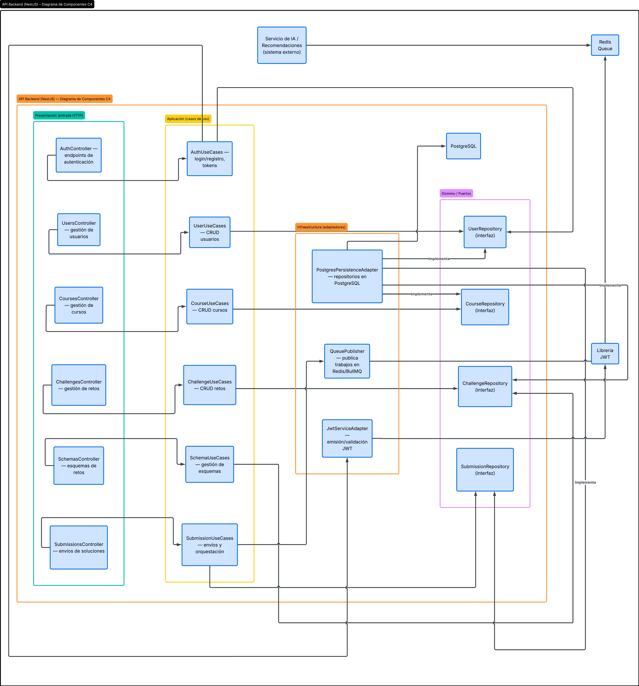

# Query Hub – Documento de diseño (Entrega parcial)

## 1. Introducción

Query Hub es una plataforma backend para evaluación automática de consultas SQL enviada por estudiantes, similar a un juez en línea pero orientado al aprendizaje de bases de datos. El sistema permite que un profesor cree retos SQL, defina esquemas, cargue o genere datos de prueba, configure resultados esperados y evalúe automáticamente las soluciones.

Además de validar si la consulta produce el resultado correcto, la plataforma mide rendimiento y genera recomendaciones en lenguaje natural para mejorar las consultas mediante un asistente inteligente.

## 2. Objetivo del sistema

Diseñar e implementar un MVP backend que pueda:

- Evaluar automáticamente consultas SQL sobre esquemas definidos por profesores.
- Medir el tiempo de ejecución y calidad de las consultas.
- Generar recomendaciones de optimización SQL.
- Organizar los retos en un contexto académico (cursos, evaluaciones, estudiantes).

Todo siguiendo principios de Clean Architecture, procesamiento asíncrono con Redis, ejecución controlada con Docker y organización por cursos y evaluaciones.

## 3. Alcance de la entrega parcial 1

La entrega parcial 1 debe entregar como mínimo:

- Diseño de arquitectura.
- Modelo de dominio.
- Diagrama de componentes.
- Autenticación con JWT.
- Gestión básica de usuarios y roles.
- CRUD de cursos.
- CRUD de retos SQL.
- Carga básica de esquemas.
- Generación inicial de datos de prueba.
- Docker Compose con API, PostgreSQL y Redis.
- Worker SQL en modo inicial o stub.
- Documentación inicial de la API.

Este documento se centra en la parte de arquitectura, diseño y organización del sistema. El detalle de endpoints se complementará en la documentación técnica de la API.

## 4. Visión general de la arquitectura

La arquitectura sigue el modelo de capas típico de Clean Architecture para aplicaciones NestJS: dominio, aplicación, infraestructura y presentación. El núcleo de negocio no depende de NestJS ni de detalles de base de datos o mensajería, sino de interfaces (puertos) que luego implementa la infraestructura.

A nivel de sistema se identifican los siguientes contenedores principales:

- API Backend (NestJS).
- Base de datos principal (PostgreSQL).
- Redis (cola de trabajos, recomendado BullMQ).
- Worker SQL.
- Runner SQL (contenedor efímero para evaluación).
- Servicio de IA o recomendaciones.

El flujo general de evaluación definido por el proyecto es:

> API → Redis Queue → Worker SQL → Runner Docker → Resultado → Base de datos

## 5. Arquitectura física (contenedores)

### 5.1 Descripción

La vista de contenedores (nivel 2 del modelo C4) muestra las aplicaciones y almacenes que componen el sistema y cómo se comunican entre sí. Para Query Hub los contenedores relevantes son:

- **Usuario profesor / Usuario estudiante**  
  Actores que interactúan con la API para gestionar cursos, retos y submissions.

- **API Backend (NestJS)**  
  Expone endpoints REST, valida autenticación y permisos, gestiona cursos, retos, esquemas y submissions, publica trabajos en Redis y consulta resultados.

- **Base de datos principal (PostgreSQL)**  
  Almacena usuarios, roles, cursos, retos, esquemas, datos de prueba registrados, submissions y resultados finales.

- **Redis Queue**  
  Cola de trabajos para el procesamiento asíncrono de submissions; la API es productora y el worker es consumidor.

- **Worker SQL**  
  Proceso que consume trabajos de Redis, prepara la ejecución, invoca al runner, calcula resultados y actualiza el estado del submission.

- **Runner SQL (contenedor Docker)**  
  Entorno temporal que crea la base de datos aislada, aplica esquema y datos de prueba, ejecuta la consulta del estudiante y devuelve resultados y métricas.

- **Servicio de IA / recomendaciones**  
  Analiza la consulta, esquema y métricas de ejecución para generar recomendaciones de optimización SQL.

### 5.2 Diagrama de contenedores



## 6. Arquitectura lógica de la API (capas internas)

La API Backend se organiza internamente en cuatro capas para mantener separación de responsabilidades y facilitar cambios futuros.

### 6.1 Domain

- Ubicación: `apps/api/src/domain/`
- Contiene entidades, value objects, enums y contratos de repositorio.
- Ejemplos: `User`, `Role`, `Course`, `Challenge`, `Submission`, interfaces de repositorio.

Esta capa expresa las reglas del negocio sin depender de NestJS, Postgres o Redis.

### 6.2 Application

- Ubicación: `apps/api/src/application/`
- Contiene casos de uso, DTOs internos y puertos de la aplicación.
- Ejemplos:
  - `CreateCourseUseCase`, `ListCoursesUseCase`.
  - `CreateChallengeUseCase`.
  - `CreateSubmissionUseCase` (registra y publica a la cola).
- Orquesta la interacción entre dominio y adaptadores externos.

### 6.3 Infrastructure

- Ubicación: `apps/api/src/infrastructure/`
- Concentra detalles técnicos:
  - `config/`: carga de variables de entorno, configuración de NestJS.
  - `database/`: conexión a PostgreSQL.
  - `persistence/`: implementaciones concretas de repositorios.
  - `queue/`: integración con Redis/BullMQ.
  - `security/`: JWT, estrategias y utilidades de seguridad.

Implementa los puertos definidos en las capas internas usando tecnologías concretas.

### 6.4 Presentation

- Ubicación: `apps/api/src/presentation/`
- Expone la API HTTP:
  - `http/controllers/`: controladores NestJS por módulo (auth, users, courses, challenges, schemas, submissions).
  - `http/dto/`: DTOs de entrada y salida.
  - `http/guards/`: guards de autenticación/autorización.
  - `modules/`: módulos NestJS por área funcional.

La lógica de negocio no se implementa en los controladores sino en los casos de uso de la capa de aplicación.

## 7. Diagrama de componentes de la API

### 7.1 Enfoque C4 Nivel 3

El diagrama de componentes (nivel 3 del modelo C4) se centra en el contenedor API Backend y descompone su interior en componentes lógicos: controladores, servicios/casos de uso, repositorios y adaptadores. No muestra clases ni métodos, solo bloques con responsabilidades y relaciones.

### 7.2 Componentes principales

Componentes sugeridos para Query Hub:

- Controladores HTTP
  - `AuthController`
  - `UsersController`
  - `CoursesController`
  - `ChallengesController`
  - `SchemasController`
  - `SubmissionsController`

- Casos de uso / servicios de aplicación
  - `AuthUseCases`
  - `UserUseCases`
  - `CourseUseCases`
  - `ChallengeUseCases`
  - `SchemaUseCases`
  - `SubmissionUseCases` (registra submission y publica en cola)

- Repositorios / puertos
  - `UserRepository`
  - `CourseRepository`
  - `ChallengeRepository`
  - `SubmissionRepository`

- Adaptadores de infraestructura
  - `PostgresPersistenceAdapter` (repositorios con PostgreSQL)
  - `QueuePublisher` (publicación en Redis/BullMQ)
  - `JwtServiceAdapter` (emisión y validación JWT)

El diagrama debe mostrar controladores llamando a casos de uso, casos de uso usando repositorios y adaptadores, y estos a su vez comunicándose con Postgres, Redis y el servicio de JWT.

### 7.3 Diagrama de componentes



## 8. Organización del repositorio

Para esta entrega el repositorio se organiza de la siguiente forma:

```text
QUERY-HUB/
├── apps/
│   ├── api/
│   │   ├── src/
│   │   │   ├── domain/
│   │   │   │   ├── entities/
│   │   │   │   ├── value-objects/
│   │   │   │   ├── enums/
│   │   │   │   └── repositories/
│   │   │   ├── application/
│   │   │   │   ├── dtos/
│   │   │   │   ├── ports/
│   │   │   │   └── use-cases/
│   │   │   ├── infrastructure/
│   │   │   │   ├── config/
│   │   │   │   ├── database/
│   │   │   │   ├── persistence/
│   │   │   │   ├── queue/
│   │   │   │   └── security/
│   │   │   ├── presentation/
│   │   │   │   ├── http/
│   │   │   │   │   ├── controllers/
│   │   │   │   │   ├── dto/
│   │   │   │   │   └── guards/
│   │   │   │   └── modules/
│   │   │   │       ├── auth/
│   │   │   │       ├── users/
│   │   │   │       ├── courses/
│   │   │   │       ├── challenges/
│   │   │   │       ├── schemas/
│   │   │   │       └── submissions/
│   │   │   ├── app.module.ts
│   │   │   └── main.ts
│   │   ├── test/
│   │   ├── Dockerfile
│   │   ├── package.json
│   │   └── tsconfig.json
│   └── worker/
│       ├── src/
│       │   ├── application/
│       │   ├── infrastructure/
│       │   └── main.ts
│       ├── Dockerfile
│       ├── package.json
│       └── tsconfig.json
├── infra/
│   ├── docker-compose.yml
│   ├── .env.example
│   └── postgres/
│       └── init/
├── 1-documentation/
│   └── README.md
├── .gitignore
└── README.md
```

Esta organización separa claramente API, worker, infraestructura (Compose y configuración de base de datos) y documentación, facilitando el trabajo colaborativo del equipo.

## 9. Módulos y responsables

Relación entre módulos del sistema y responsables de implementación para la entrega parcial 1:

| Módulo | Contenido principal | Responsable |
|---|---|---|
| Infraestructura y arquitectura | Infraestructura y Arquitectura. Diseño de arquitectura. Diagrama de componentes. Docker Compose con API, PostgreSQL y Redis. | Carlos |
| Dominio y seguridad | Dominio y Seguridad. Modelo de dominio. Autenticación con JWT. Gestión básica de usuarios y roles. | Darlen |
| Gestión académica | Gestión Académica y Documentación. CRUD de cursos. Documentación inicial de la API (es responsable de consolidar la documentación técnica de todos los módulos). | Kevin C |
| Gestión de retos y esquemas | Gestión de Retos y Esquemas. CRUD de retos SQL. Carga básica de esquemas. | Sebastian |
| Automatización | Automatización y Datos. Generación inicial de datos de prueba. Worker SQL en modo inicial o stub. Apoyo técnico a la Persona 4 (para asegurar que los esquemas y datos sean compatibles con la lógica del Worker). | Kevin R |

## 10. Infraestructura y Docker Compose

La infraestructura mínima para la parcial 1 incluye:

- Servicio `api` (NestJS) conectado a:
  - `postgres` (base principal).
  - `redis` (cola de trabajos).
- Servicio `worker` que comparta red con `api` y `redis`.
- Volumen para datos de Postgres.
- Archivo `.env.example` con variables básicas (host, port, credenciales de Postgres, configuración de Redis, secretos JWT). - obviamente sin las variables reales.
- Crear `.env.local` y `.gitignore` correspondiente para el proyecto.

El objetivo de Compose en esta etapa es demostrar el stack API + PostgreSQL + Redis + worker stub corriendo en contenedores, tal como exige el enunciado.